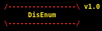

<p align="center">
  
</p>
<h3 align='center'>An AIO Token-Stealer Generator & Token Enumerator</h3>


## Usage

To use disenum to Generate a Token-Stealer, run `python3 disenum.py --generate`

To use disenum to Enumerate a Discord Token, run `python3 disenum.py --token (DISCORD TOKEN)`

You can also use `python3 disenum.py -h` to get a quick help message (Displayed Below)

```
usage: disenum.py [-h] [--generate] [--token TOKEN]

Discord Token Enumeration

optional arguments:
  -h, --help     show this help message and exit
  --generate     Generate Obfuscated Python code that will quickly grab Discord Tokens saved locally.
  --token TOKEN  A Discord Token to Enumerate.
```

## Output & Results

Disenum enumerates the Token User's:

* Chats + Last 10 Messages for each one
  * Direct Messages
  * Group Chats
* Friends
* Payment Methods

Disenum is unique as it will output it's extensive enumeration results to readable and sorted text files!

Below is a file tree diagram to show how disenum stores it's results:

```
├── disenum.py
├── lib
│   ├── enum.py
│   ├── generation.py
│   └── tokencheck.py
└── results
    ├── chats
    │   ├── groupchats
    │   │   └── groupchat1_ID.txt
    │   └── users
    │       ├── user1_ID.txt
    │       ├── user2_ID.txt
    │       └── user3_ID.txt
    ├── friends
    │   ├── examplefriend1_ID.txt
    │   └── examplefriend2_ID.txt
    └── payment-methods
        └── paymentmethod1.txt
```

## Installation

#### Linux / OSX

(warning: if you are using OSX, check you have git installed! if you don't, use brew to install it !!!)

(if you're using linux and don't have git installed, use `sudo apt-get install git`)

```
git clone https://github.com/spicesouls/disenum
cd disenum
python3 -m pip3 install -r requirements.txt
```

#### Windows

Download the latest Release for this repository as a ZIP, extract, then open Cmd Prompt in the directoy disenum is installed in and run:

```
python3 -m pip3 install -r requirements.txt
```
